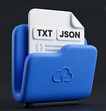
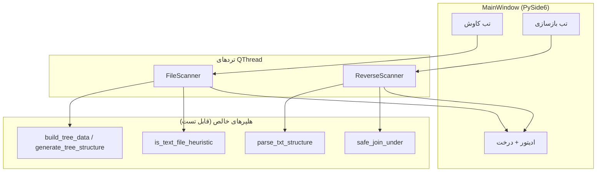
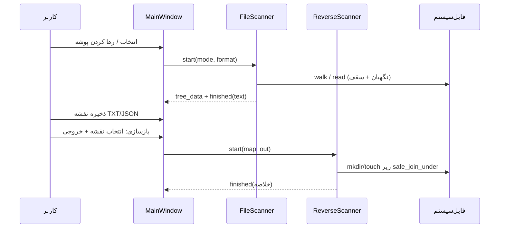
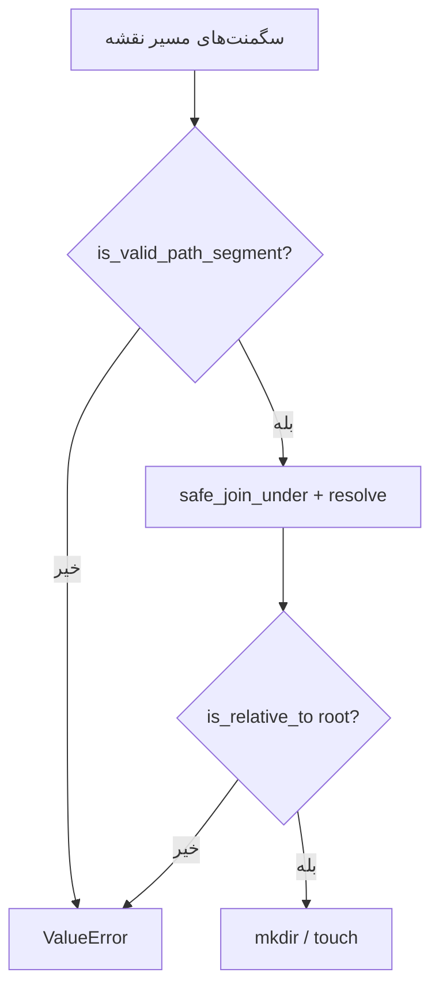

# کاوشگر هوشمند پروژه | File Explorer

<p align="center">
  
</p>

<p align="center">
<a href="README.md">English</a> · <strong>فارسی</strong>
</p>

[](https://www.python.org/downloads/)
[](https://doc.qt.io/qtforpython/)
[](LICENSE)
[](pyproject.toml)
[](#پیش‌نیازها)

> **کاوشگر هوشمند پروژه** — ابزار دسکتاپ برای اسکن پوشه به نقشهٔ تمیز **TXT**/**JSON** و بازسازی اسکلت **خالی** پوشه/فایل — با نگهبان مسیر، سقف اندازه، و رابط PySide6 راست‌به‌چپ.

**پیوندهای سریع:** [شروع سریع](#شروع-سریع) · [معماری](#معماری) · [ویژگی‌ها](#ویژگی‌ها) · [مستندات](docs/README.fa.md) · [English](README.md) · [مشارکت](CONTRIBUTING.fa.md) · [امنیت](SECURITY.fa.md) · [مجوز](#مجوز)

---

## این پروژه چیست؟

**File Explorer (کاوشگر هوشمند پروژه)** یک اپ دسکتاپ ویندوزمحور برای این کارهاست:

1. **نقشه‌برداری پروژه** — پیمایش پوشه و خروجی درخت (**ساختار**) یا dump کامل متن/کد (**کامل**).
2. **بازسازی اسکلت** — ساخت مجدد پوشه و فایل **خالی** از نقشهٔ TXT/JSON قبلی (بدون بازگردانی محتوا).
3. **پیش‌فرض‌های ایمن** — نگهبان path traversal، رد symlink، نادیده گرفتن پوشه‌های سنگین، و سقف حافظه (۱۰ مگ/فایل، ۵۰ مگ کل).

برای توسعه‌دهندگان و بازبین‌هایی که به **نقشهٔ قابل اشتراک** یا **اسکلت خالی درخت** نیاز دارند، بدون ارسال کل ریپو.

ساخته‌شده توسط **علی رشیدی**.

---

## فهرست مطالب

- [چرا](#چرا)
- [ویژگی‌ها](#ویژگی‌ها)
- [معماری](#معماری)
- [جریان داده](#جریان-داده)
- [حالت‌ها و فرمت‌ها](#حالت‌ها-و-فرمت‌ها)
- [پیش‌نیازها](#پیش‌نیازها)
- [شروع سریع](#شروع-سریع)
- [نصب](#نصب)
- [استفاده](#استفاده)
- [ساختار پروژه](#ساختار-پروژه)
- [ساخت EXE قابل حمل](#ساخت-exe-قابل-حمل)
- [تست و QA](#تست-و-qa)
- [پیکربندی و محدودیت‌ها](#پیکربندی-و-محدودیت‌ها)
- [امنیت](#امنیت)
- [عیب‌یابی](#عیب‌یابی)
- [مستندات](#مستندات)
- [نقشه راه](#نقشه-راه)
- [مشارکت](#مشارکت)
- [نگهدارندگان](#نگهدارندگان)
- [سپاس](#سپاس)
- [مجوز](#مجوز)

---

## چرا

| درد | کاری که این برنامه می‌کند |
|-----|---------------------------|
| اشتراک کل ریپو برای AI/بازبینی شلوغ است | یک **نقشهٔ خوانا** (درخت یا dump متنی) صادر می‌کند |
| از خروجی قبلی به اسکلت پوشه نیاز دارید | حالت **بازسازی** پوشه/فایل خالی می‌سازد |
| اسکنر ساده‌لوح RAM را می‌ترکاند یا از مسیر فرار می‌کند | سقف **۵۰ مگ** خروجی، رد فایل بالای **۱۰ مگ**، نگهبان path traversal |
| کاربر غیر CLI به UX دسکتاپ نیاز دارد | تم تیره RTL، Drag & Drop، پیشرفت، ترد قابل توقف |

این برنامه **جایگزین File Explorer ویندوز نیست**. یک **نقشه‌کش پروژه + بازسازی اسکلت** است.

---

## ویژگی‌ها

| حوزه | قابلیت |
|------|--------|
| **کاوش — کامل** | پیمایش درخت؛ استخراج محتوای متن/کد در یک گزارش TXT |
| **کاوش — فقط ساختار** | خروجی درختی TXT (`├──`/`└──`) یا JSON |
| **بازسازی** | ساخت مجدد پوشه/فایل **خالی** از نقشه TXT/JSON (بدون بازگردانی محتوا) |
| **ایمنی** | `safe_join_under`، رد `..`، نام‌های رزرو ویندوز، رد symlink |
| **سقف‌ها** | رد فایل متنی &gt; ۱۰ مگ؛ توقف وقتی خروجی تجمعی &gt; ۵۰ مگ |
| **نادیده‌گیری** | `.git`، `node_modules`، `venv`، `.venv`، `__pycache__`، پوشه‌های IDE/build |
| **UX** | Drag & Drop، تم تیره، پیش‌نمایش درخت، کپی/ذخیره |
| **بسته‌بندی** | EXE تک‌فایلی با `build.bat` / `build_portable.bat` |
| **کیفیت** | تست واحد، E2E زنده، production-live + دروازهٔ `qa.bat` |

---

## معماری



نقطهٔ ورود فعال: [`file-explorer-pyside6.py`](file-explorer-pyside6.py) (نسخه ۵.۱).  
میراث (خارج از بیلد رسمی): [`file_explorer.py`](file_explorer.py) (مسیر قدیمی PyQt6).

جزئیات بیشتر: [docs/ARCHITECTURE.fa.md](docs/ARCHITECTURE.fa.md) · [docs/ARCHITECTURE.md](docs/ARCHITECTURE.md)

---

## جریان داده



---

## حالت‌ها و فرمت‌ها

| حالت | TXT | JSON | محتوا؟ |
|------|:---:|:----:|:------:|
| **کامل** (متن/کد) | ✅ | ❌ (UI قفل می‌کند) | بله (با سقف اندازه) |
| **فقط ساختار** | ✅ | ✅ | خیر — فقط درخت / JSON درخت |

**قاعدهٔ صادقانهٔ بازسازی:** فقط پوشهٔ خالی و فایل **صفر بایتی** ساخته می‌شود. محتوای فایل‌ها از نقشه بازگردانی نمی‌شود.


---

## پیش‌نیازها

| نیاز | توضیح |
|------|--------|
| **سیستم‌عامل** | ویندوز توصیه‌شده (EXE قابل حمل و long-path). لینوکس/مک ممکن است از سورس با پلاگین Qt اجرا شوند. |
| **Python** | **۳.۱۰+** |
| **وابستگی اجرا** | `PySide6>=6.6.0` |
| **توسعه / QA** | `requirements-dev.txt` |
| **ساخت EXE** | Python + pip؛ PyInstaller توسط `build.bat`؛ UPX اختیاری |

---

## شروع سریع

### اجرا از سورس

```bat
git clone https://github.com/Ali-Rashidi-80/File-Explorer.git
cd "File-Explorer"
pip install -r requirements.txt
python file-explorer-pyside6.py
```

### EXE قابل حمل (بدون پایتون روی سیستم هدف)

```bat
build_portable.bat
```

خروجی: `dist\FileExplorer_Portable.exe`

یادداشت کوتاه: [`install.txt`](install.txt).

---

## نصب

```bat
pip install -r requirements.txt
```

ابزار توسعه:

```bat
pip install -r requirements-dev.txt
qa.bat
```

---

## استفاده

1. برنامه را اجرا کنید.
2. در **تب کاوش** حالت و فرمت را انتخاب کنید.
3. پوشه را انتخاب یا Drag & Drop کنید.
4. **شروع اسکن** را بزنید.
5. خروجی را کپی یا **ذخیره** کنید.
6. در **تب بازسازی** نقشه را انتخاب و اسکلت خالی بسازید.

راهنمای کامل: [docs/USAGE.fa.md](docs/USAGE.fa.md) · [docs/USAGE.md](docs/USAGE.md)

---

## ساختار پروژه

```text
File Explorer/
├── file-explorer-pyside6.py   # اپ فعال PySide6 (v5.1)
├── file_explorer.py           # اسکریپت میراث PyQt6
├── icon.ico                   # آیکون اپ / EXE (لوگوی منبع)
├── requirements.txt / requirements-dev.txt
├── pyproject.toml
├── qa.bat / build.bat / build_portable.bat
├── FileExplorer.portable.spec
├── tests/
├── docs/                      # مستندات گسترده (EN + FA)
│   └── assets/file-explorer-logo.png  # لوگو برای README (از icon.ico)
├── README.md                  # انگلیسی (پیش‌فرض)
├── README.fa.md               # همین فایل
├── LICENSE / CHANGELOG*.md
├── CONTRIBUTING*.md / SECURITY*.md
└── AGENTS.md
```

---

## ساخت EXE قابل حمل

```bat
build.bat
```

جزئیات: [docs/BUILD.fa.md](docs/BUILD.fa.md) · [docs/BUILD.md](docs/BUILD.md)

---

## تست و QA

```bat
pip install -r requirements-dev.txt
python -m pytest tests -q
qa.bat
```

`qa.bat`: pytest → ruff → flake8 → isort → black → mypy → compileall → pylint → bandit.

---

## پیکربندی و محدودیت‌ها

| ثابت | مقدار | نقش |
|------|-------|-----|
| `MAX_TEXT_FILE_SIZE_MB` | `10` | رد استخراج فایل متنی خیلی بزرگ |
| `MAX_TOTAL_OUTPUT_BYTES` | `50 MiB` | سقف خروجی حالت کامل |
| `MAX_TREE_EXPAND_NODES` | `2000` | سقف گسترش درخت UI |
| `IGNORED_DIRS` | `.git`, `node_modules`, … | نادیده در walk |

مرجع هلپرها: [docs/API.fa.md](docs/API.fa.md)

---

## امنیت

ورودی نقشه در بازسازی غیرقابل اعتماد فرض می‌شود: رد traversal، نام رزرو، symlink، و جداسازی تردها.

گزارش آسیب‌پذیری: [SECURITY.fa.md](SECURITY.fa.md) · [SECURITY.md](SECURITY.md)



---

## عیب‌یابی

| علامت | راه حل محتمل |
|-------|----------------|
| `ModuleNotFoundError: PySide6` | `pip install -r requirements.txt` |
| EXE ساخته نشد | دوباره `build.bat`؛ خطای PyInstaller را بخوانید |
| JSON در حالت کامل غیرفعال | طراحی عمدی — JSON فقط ساختار |
| بازسازی فایل خالی ساخت | طراحی عمدی — فقط اسکلت |
| پروژه خیلی بزرگ قطع شد | سقف ۵۰ مگ / ۱۰ مگ به‌ازای فایل |

راهنما: [docs/TROUBLESHOOTING.fa.md](docs/TROUBLESHOOTING.fa.md)

---

## مستندات

| موضوع | English | فارسی |
|-------|---------|-------|
| معماری | [ARCHITECTURE.md](docs/ARCHITECTURE.md) | [ARCHITECTURE.fa.md](docs/ARCHITECTURE.fa.md) |
| استفاده | [USAGE.md](docs/USAGE.md) | [USAGE.fa.md](docs/USAGE.fa.md) |
| ساخت | [BUILD.md](docs/BUILD.md) | [BUILD.fa.md](docs/BUILD.fa.md) |
| API | [API.md](docs/API.md) | [API.fa.md](docs/API.fa.md) |
| عیب‌یابی | [TROUBLESHOOTING.md](docs/TROUBLESHOOTING.md) | [TROUBLESHOOTING.fa.md](docs/TROUBLESHOOTING.fa.md) |
| تغییرات | [CHANGELOG.md](CHANGELOG.md) | [CHANGELOG.fa.md](CHANGELOG.fa.md) |
| مشارکت | [CONTRIBUTING.md](CONTRIBUTING.md) | [CONTRIBUTING.fa.md](CONTRIBUTING.fa.md) |
| امنیت | [SECURITY.md](SECURITY.md) | [SECURITY.fa.md](SECURITY.fa.md) |
| منشور رفتار | [CODE_OF_CONDUCT.md](CODE_OF_CONDUCT.md) | [CODE_OF_CONDUCT.fa.md](CODE_OF_CONDUCT.fa.md) |

---

## نقشه راه

- [ ] بازگردانی اختیاری محتوا در reverse (opt-in صریح + سقف اندازه)
- [ ] ماتریس CI غیر ویندوز برای اجرای سورس
- [ ] اسکرین/GIF از UI در `docs/assets/` (لوگوی اپ از قبل موجود است)
- [ ] GitHub Actions هم‌تراز با `qa.bat`

وضعیت صادقانه: **v5.1 پولیش ضدگلوله** برای اسکن/بازسازی/ایمنی/QA است — [CHANGELOG.fa.md](CHANGELOG.fa.md).

---

## مشارکت

PRها خوش‌آمدند. [CONTRIBUTING.fa.md](CONTRIBUTING.fa.md) و منشور رفتار را بخوانید و قبل از PR حتماً `qa.bat` را اجرا کنید.

سؤالات → [GitHub Issues](https://github.com/Ali-Rashidi-80/File-Explorer/issues).

---

## نگهدارندگان

- **Ali-Rashidi-80** — [@Ali-Rashidi-80](https://github.com/Ali-Rashidi-80)

---

## سپاس

- [PySide6 / Qt for Python](https://doc.qt.io/qtforpython/)
- [PyInstaller](https://pyinstaller.org/)
- [pytest](https://pytest.org/) و [pytest-qt](https://pytest-qt.readthedocs.io/)
- چیدمان README هم‌تراز با سبک خانهٔ [rashid-agent](https://github.com/Ali-Rashidi-80/rashid-agent)، به‌همراه [Standard Readme](https://github.com/RichardLitt/standard-readme) و [OSS Spec](https://github.com/niclaslindstedt/oss-spec)

---

## مجوز

[MIT](LICENSE) © ۲۰۲۶ Ali-Rashidi-80
