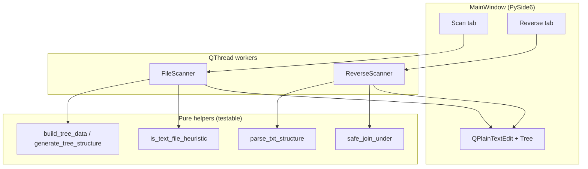
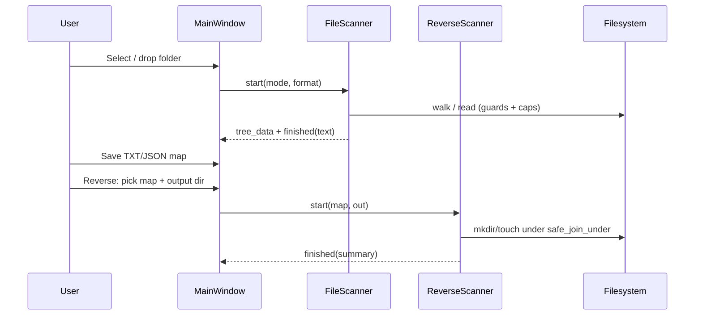
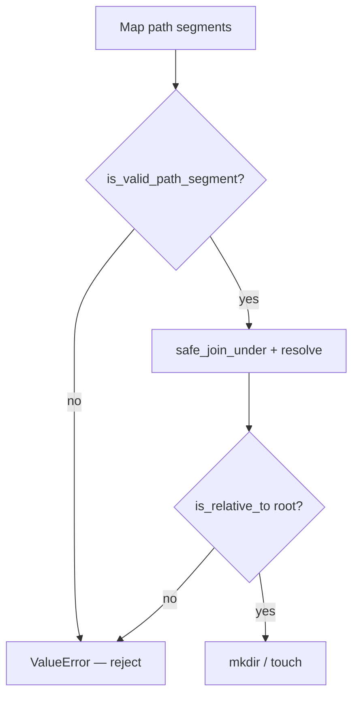

# File Explorer

<p align="center">
  
</p>

<p align="center">
<strong>English</strong> · <a href="README.fa.md">فارسی</a>
</p>

[](https://www.python.org/downloads/)
[](https://doc.qt.io/qtforpython/)
[](LICENSE)
[](pyproject.toml)
[](#prerequisites)

> **Smart Project Explorer** — desktop utility that scans a project folder into clean **TXT**/**JSON** maps and reverse-rebuilds an **empty** folder/file scaffold — with path guards, size caps, and a PySide6 RTL UI.

**Quick links:** [Quick Start](#quick-start) · [Architecture](#architecture) · [Features](#features) · [Docs](docs/README.md) · [فارسی](README.fa.md) · [Contributing](CONTRIBUTING.md) · [Security](SECURITY.md) · [License](#license)

---

## What it is

**File Explorer** (کاوشگر هوشمند پروژه) is a Windows-first desktop app for:

1. **Project mapping** — walk a folder and export a readable tree (**structure**) or a full text/code dump (**full**).
2. **Scaffold reverse** — rebuild **empty** directories and files from a prior TXT/JSON map (no content restore).
3. **Safe defaults** — path traversal guards, symlink skip, ignored heavy dirs, and memory caps (10 MB/file, 50 MB total).

Built for developers and reviewers who need a **shareable project map** or an **empty tree scaffold** without shipping the whole repo.

Created by **Ali Rashidi**.

---

## Table of contents

- [Why](#why)
- [Features](#features)
- [Architecture](#architecture)
- [Data flow](#data-flow)
- [Scan modes & formats](#scan-modes--formats)
- [Prerequisites](#prerequisites)
- [Quick start](#quick-start)
- [Installation](#installation)
- [Usage](#usage)
- [Project structure](#project-structure)
- [Portable EXE build](#portable-exe-build)
- [Testing & QA](#testing--qa)
- [Configuration & limits](#configuration--limits)
- [Security](#security)
- [Troubleshooting](#troubleshooting)
- [Documentation](#documentation)
- [Roadmap](#roadmap)
- [Contributing](#contributing)
- [Maintainers](#maintainers)
- [Acknowledgements](#acknowledgements)
- [License](#license)

---

## Why

| Pain | What this app does |
|------|--------------------|
| Sharing a whole repo for AI / review is noisy | Export a **readable map** (tree or full text dump) |
| You need a scaffold from a prior export | **Reverse** mode recreates empty dirs/files from TXT/JSON |
| Naive scanners blow RAM or escape paths | **50 MB** output cap, **10 MB**/file skip, path traversal guards |
| Desktop UX matters for non-CLI users | Dark RTL UI, Drag & Drop, progress, cancel-safe threads |

This is **not** a Windows Explorer replacement. It is a **project cartographer + scaffold reverse** tool.

---

## Features

| Area | Capability |
|------|------------|
| **Scan — full** | Walk the tree; extract text/code contents into a single TXT report |
| **Scan — structure** | Tree-only export as TXT (`├──`/`└──`) or JSON |
| **Reverse** | Rebuild **empty** folders/files from a prior TXT/JSON map (no content restore) |
| **Safety** | `safe_join_under`, reject `..`, reserved Windows names, symlink skip |
| **Limits** | Skip text files &gt; 10 MB; stop when cumulative text output &gt; 50 MB |
| **Ignore** | `.git`, `node_modules`, `venv`, `.venv`, `__pycache__`, IDE/build folders |
| **UX** | Drag & Drop folder, dark theme, live tree preview, copy/save |
| **Packaging** | One-file portable EXE via `build.bat` / `build_portable.bat` |
| **Quality** | Unit, live E2E, production-style tests + `qa.bat` lint/security gate |

---

## Architecture



Active entry point: [`file-explorer-pyside6.py`](file-explorer-pyside6.py) (v5.1).  
Legacy (not maintained for builds): [`file_explorer.py`](file_explorer.py) (older PyQt6 path).

More detail: [docs/ARCHITECTURE.md](docs/ARCHITECTURE.md) · [docs/ARCHITECTURE.fa.md](docs/ARCHITECTURE.fa.md)

---

## Data flow



---

## Scan modes & formats

| Mode | TXT | JSON | Contents? |
|------|:---:|:----:|:---------:|
| **Full** (all text/code) | ✅ | ❌ (UI locks JSON) | Yes (with size caps) |
| **Structure only** | ✅ | ✅ | No — tree / JSON tree only |

**Reverse honesty rule:** reverse rebuild creates **empty** directories and **zero-byte** files. File bodies are never restored from the map.


---

## Prerequisites

| Requirement | Notes |
|-------------|--------|
| **OS** | Windows recommended (portable EXE & long-path helpers). Linux/macOS may run from source with Qt platform plugins. |
| **Python** | **3.10+** (`requires-python` in `pyproject.toml`) |
| **Runtime dep** | `PySide6>=6.6.0` |
| **Dev / QA** | See `requirements-dev.txt` (pytest, ruff, black, mypy, bandit, …) |
| **EXE build** | Python + pip; PyInstaller installed by `build.bat`; optional UPX |

---

## Quick start

### Run from source

```bat
git clone https://github.com/Ali-Rashidi-80/File-Explorer.git
cd "File-Explorer"
pip install -r requirements.txt
python file-explorer-pyside6.py
```

### Portable EXE (no Python on the target PC)

```bat
build_portable.bat
```

Output: `dist\FileExplorer_Portable.exe` — copy anywhere and run.

Short notes also live in [`install.txt`](install.txt).

---

## Installation

### Dependencies only

```bat
pip install -r requirements.txt
```

### Developer / QA toolchain

```bat
pip install -r requirements-dev.txt
qa.bat
```

### Verify import

```bat
python -c "from PySide6.QtWidgets import QApplication; print('PySide6 OK')"
```

---

## Usage

1. Launch the app (`python file-explorer-pyside6.py` or the portable EXE).
2. **Scan tab:** choose mode (full / structure) and format (TXT / JSON when allowed).
3. Select a folder (button or Drag & Drop).
4. Click **Start scan** — watch progress and the live tree.
5. Copy or **Save** the output map.
6. **Reverse tab:** pick a TXT/JSON map → choose output directory → rebuild empty scaffold.

Deep walkthrough: [docs/USAGE.md](docs/USAGE.md) · [docs/USAGE.fa.md](docs/USAGE.fa.md)

<details>
<summary>Example structure TXT snippet</summary>

```text
ریشه پروژه:
D:\demo_project
================================================================================
├── src/
│   ├── main.py
│   └── utils.py
└── README.md
================================================================================
```

</details>

<details>
<summary>Example structure JSON shape</summary>

```json
{
  "name": "demo_project",
  "type": "directory",
  "children": [
    { "name": "src", "type": "directory", "children": [
      { "name": "main.py", "type": "file" }
    ]},
    { "name": "README.md", "type": "file" }
  ]
}
```

</details>

---

## Project structure

```text
File Explorer/
├── file-explorer-pyside6.py   # Active PySide6 app (v5.1)
├── file_explorer.py           # Legacy PyQt6 script (not used by build)
├── icon.ico                   # App / EXE icon (source logo)
├── requirements.txt
├── requirements-dev.txt
├── pyproject.toml             # black / ruff / mypy / pytest config
├── qa.bat                     # Full quality gate
├── build.bat / build_portable.bat
├── FileExplorer.portable.spec # PyInstaller onefile
├── tests/                     # Core + live E2E + production live
├── docs/                      # Extended documentation (EN + FA)
│   └── assets/file-explorer-logo.png  # Logo for README (from icon.ico)
├── README.md                  # This file (English default)
├── README.fa.md               # Persian README
├── LICENSE
├── CHANGELOG.md
├── CONTRIBUTING.md
├── CODE_OF_CONDUCT.md
├── SECURITY.md
└── AGENTS.md
```

---

## Portable EXE build

```bat
build.bat
rem or
build_portable.bat
```

| Step | What happens |
|------|----------------|
| 1–2 | Check Python; install PySide6 + PyInstaller |
| 3 | Locate or download UPX (optional compression) |
| 4 | Clean previous portable artifacts |
| 5 | `PyInstaller` onefile via `FileExplorer.portable.spec` |
| 6 | Verify `dist\FileExplorer_Portable.exe` |

Details: [docs/BUILD.md](docs/BUILD.md) · [docs/BUILD.fa.md](docs/BUILD.fa.md) · [`pyinstaller.txt`](pyinstaller.txt)

---

## Testing & QA

```bat
pip install -r requirements-dev.txt
python -m pytest tests -q
qa.bat
```

`qa.bat` runs: **pytest → ruff → flake8 → isort → black → mypy → compileall → pylint (errors) → bandit**.

| Suite | Focus |
|-------|--------|
| `tests/test_scanner_core.py` | Path safety, tree parse, scan/reverse helpers |
| `tests/test_live_e2e.py` | Real QThreads + MainWindow flows |
| `tests/test_production_live.py` | Unicode paths, stress, busy guards |
| `tests/test_qa_tooling.py` | Tooling / packaging sanity |

---

## Configuration & limits

| Constant | Value | Role |
|----------|-------|------|
| `MAX_TEXT_FILE_SIZE_MB` | `10` | Skip extracting huge text files |
| `MAX_TOTAL_OUTPUT_BYTES` | `50 MiB` | Cap cumulative full-scan text |
| `MAX_TREE_EXPAND_NODES` | `2000` | UI tree expansion guard |
| `IGNORED_DIRS` | `.git`, `node_modules`, … | Skipped during walk |
| `KNOWN_TEXT_EXTENSIONS` | `.py`, `.md`, `.ts`, … | Text heuristic allow-list |

These live at the top of [`file-explorer-pyside6.py`](file-explorer-pyside6.py). There is no separate config file in v5.1.

API-style helper reference: [docs/API.md](docs/API.md) · [docs/API.fa.md](docs/API.fa.md)

---

## Security

Path reverse/rebuild is treated as untrusted input:

- Reject `..`, absolute segments, invalid/reserved Windows names (`NUL`, `CON`, …)
- Resolve + `is_relative_to` so writes cannot escape the output root
- Skip symlinks during scan
- Interruptible worker threads; busy UI prevents overlapping jobs

Report vulnerabilities privately — see [SECURITY.md](SECURITY.md) · [SECURITY.fa.md](SECURITY.fa.md).



---

## Troubleshooting

| Symptom | Likely fix |
|---------|------------|
| `ModuleNotFoundError: PySide6` | `pip install -r requirements.txt` |
| EXE missing after build | Re-run `build.bat`; check console for PyInstaller errors |
| Full mode + JSON disabled | By design — JSON is structure-only |
| Reverse made empty files | By design — scaffold only, no content restore |
| Huge project freezes / caps | Expected once 50 MB output or 10 MB/file limits hit |
| Offscreen pytest on CI | `QT_QPA_PLATFORM=offscreen` (tests set this) |

Full guide: [docs/TROUBLESHOOTING.md](docs/TROUBLESHOOTING.md) · [docs/TROUBLESHOOTING.fa.md](docs/TROUBLESHOOTING.fa.md)

---

## Documentation

| Doc | English | فارسی |
|-----|---------|-------|
| Architecture | [docs/ARCHITECTURE.md](docs/ARCHITECTURE.md) | [docs/ARCHITECTURE.fa.md](docs/ARCHITECTURE.fa.md) |
| Usage | [docs/USAGE.md](docs/USAGE.md) | [docs/USAGE.fa.md](docs/USAGE.fa.md) |
| Build | [docs/BUILD.md](docs/BUILD.md) | [docs/BUILD.fa.md](docs/BUILD.fa.md) |
| API helpers | [docs/API.md](docs/API.md) | [docs/API.fa.md](docs/API.fa.md) |
| Troubleshooting | [docs/TROUBLESHOOTING.md](docs/TROUBLESHOOTING.md) | [docs/TROUBLESHOOTING.fa.md](docs/TROUBLESHOOTING.fa.md) |
| Changelog | [CHANGELOG.md](CHANGELOG.md) | [CHANGELOG.fa.md](CHANGELOG.fa.md) |
| Contributing | [CONTRIBUTING.md](CONTRIBUTING.md) | [CONTRIBUTING.fa.md](CONTRIBUTING.fa.md) |
| Security | [SECURITY.md](SECURITY.md) | [SECURITY.fa.md](SECURITY.fa.md) |
| Code of Conduct | [CODE_OF_CONDUCT.md](CODE_OF_CONDUCT.md) | [CODE_OF_CONDUCT.fa.md](CODE_OF_CONDUCT.fa.md) |
| AI agents | [AGENTS.md](AGENTS.md) | — |

---

## Roadmap

- [ ] Optional content restore for reverse (explicit opt-in, size-capped)
- [ ] Non-Windows CI matrix for source runs
- [ ] UI screenshot / GIF demo under `docs/assets/` (app logo already present)
- [ ] GitHub Actions workflow mirroring `qa.bat`

Honest status: **v5.1 is the bulletproof polish** of scan/reverse/safety/QA — see [CHANGELOG.md](CHANGELOG.md).

---

## Contributing

PRs are welcome. Please read [CONTRIBUTING.md](CONTRIBUTING.md) (and [CONTRIBUTING.fa.md](CONTRIBUTING.fa.md)), follow the Code of Conduct, and run `qa.bat` before opening a PR.

Questions → [GitHub Issues](https://github.com/Ali-Rashidi-80/File-Explorer/issues).

---

## Maintainers

- **Ali-Rashidi-80** — [@Ali-Rashidi-80](https://github.com/Ali-Rashidi-80)

---

## Acknowledgements

- [PySide6 / Qt for Python](https://doc.qt.io/qtforpython/)
- [PyInstaller](https://pyinstaller.org/)
- [pytest](https://pytest.org/) & [pytest-qt](https://pytest-qt.readthedocs.io/)
- README layout aligned with the house style of [rashid-agent](https://github.com/Ali-Rashidi-80/rashid-agent), plus [Standard Readme](https://github.com/RichardLitt/standard-readme) and [OSS Spec](https://github.com/niclaslindstedt/oss-spec)

---

## License

[MIT](LICENSE) © 2026 Ali-Rashidi-80
