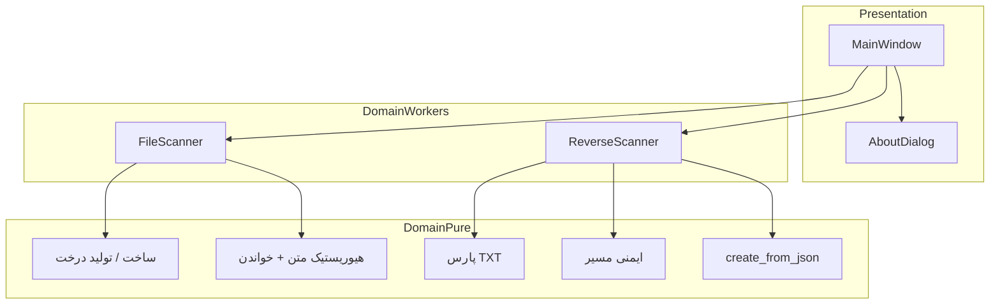

# معماری

**زبان‌ها:** [English](ARCHITECTURE.md) · **فارسی**

## نمای کلی

File Explorer نسخه ۵.۱ یک اپ دسکتاپ تک‌ماژوله با PySide6 است. منطق بدون GUI به‌صورت **هلپر خالص** بالای `file-explorer-pyside6.py` است. I/O طولانی روی **QThread** اجرا می‌شود تا UI پاسخگو بماند.

## لایه‌ها

| لایه | اجزا | مسئولیت |
|------|------|---------|
| UI | `MainWindow`, `AboutDialog` | منو، تب، DnD، تم، پیشرفت، ذخیره/کپی |
| Workers | `FileScanner`, `ReverseScanner` | اسکن/بازسازی پس‌زمینه؛ سیگنال |
| هسته خالص | هلپرها | منطق قطعی و قابل تست واحد |

## مدل ترد

- ویژگی‌های جدا: `scan_thread`، `reverse_thread`
- پرچم busy کنترل‌های متعارض را غیرفعال می‌کند
- `closeEvent` وقفه می‌خواهد و کوتاه منتظر خاموشی تمیز می‌ماند

## خط لوله اسکن

1. ساخت درخت حافظه → emit برای پیش‌نمایش UI.
2. **حالت ساختار:** خطوط درخت TXT یا dump JSON.
3. **حالت کامل:** `os.walk` با ignore و رد symlink؛ هیوریستیک متن؛ سقف بایت؛ پیشرفت.

## خط لوله بازسازی

1. خواندن نقشه UTF-8 (fallback مسیر بلند ویندوز).
2. **TXT:** `parse_txt_structure` → mkdir/touch با `safe_join_under`.
3. **JSON:** `create_from_json` بازگشتی با همان نگهبان.

## مرتبط

- [USAGE.fa.md](USAGE.fa.md) · [API.fa.md](API.fa.md) · [BUILD.fa.md](BUILD.fa.md) · [../SECURITY.fa.md](../SECURITY.fa.md)
