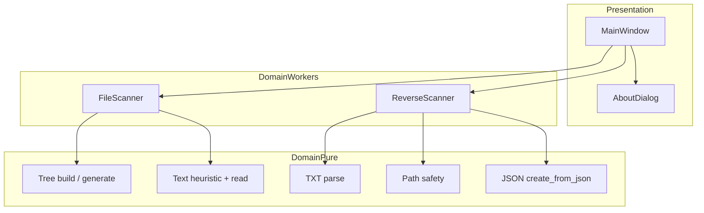
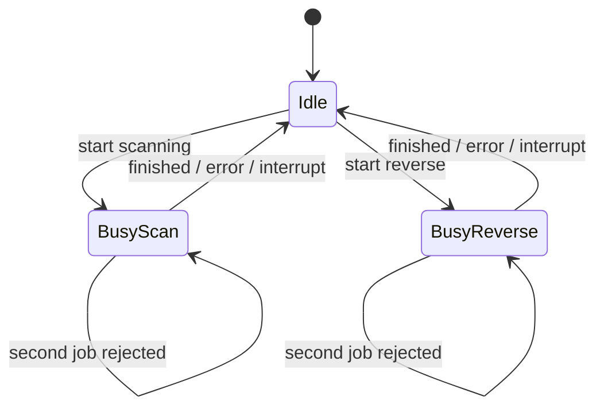
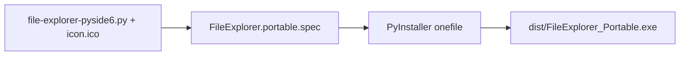

# Architecture

**Languages:** **English** · [فارسی](ARCHITECTURE.fa.md)

## Overview

File Explorer v5.1 is a single-module PySide6 desktop application. Business logic that can run without a GUI lives as **pure helpers** at the top of `file-explorer-pyside6.py`. Long-running I/O runs on **QThread** workers so the UI stays responsive.

## Layers

| Layer | Components | Responsibility |
|-------|------------|----------------|
| UI | `MainWindow`, `AboutDialog` | Menus, tabs, DnD, theme, progress, save/copy |
| Workers | `FileScanner`, `ReverseScanner` | Background scan / reverse; emit signals |
| Pure core | helpers listed below | Deterministic, unit-tested filesystem logic |

## Threading model

- Separate attributes: `scan_thread`, `reverse_thread`
- Busy flag disables conflicting controls
- `closeEvent` requests interruption and waits briefly for clean shutdown

## Scan pipeline

1. Build in-memory tree (`build_tree_data`) → emit for UI preview.
2. **Structure mode:** emit TXT tree lines or JSON dump.
3. **Full mode:** `os.walk` with ignored dirs + symlink skip; for each file apply text heuristic; append content or markers; enforce byte caps; emit progress.

## Reverse pipeline

1. Read map as UTF-8 (long-path fallback on Windows).
2. **TXT:** `parse_txt_structure` → mkdir/touch via `safe_join_under`.
3. **JSON:** `create_from_json` recursively with the same join guard.

## Packaging topology

## Testing topology

| Test module | Proves |
|-------------|--------|
| `test_scanner_core` | Path guards, parse levels, helper contracts |
| `test_live_e2e` | Real threads + MainWindow happy paths |
| `test_production_live` | Unicode / stress / busy guards |
| `test_qa_tooling` | Tooling expectations |

## Related

- [USAGE.md](USAGE.md) — operator flows
- [API.md](API.md) — helper signatures
- [BUILD.md](BUILD.md) — EXE pipeline
- [../SECURITY.md](../SECURITY.md) — threat model notes
